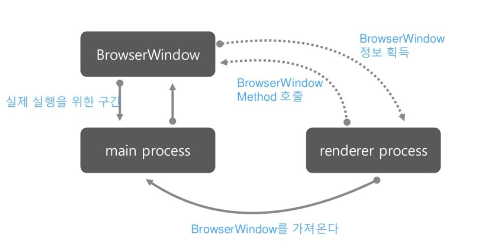

# Electron Tutorial

**Table of Contents**

- [Introduce](#Introduce)
- [Quick start](#Quick-start)
- [Inter process communication](#Inter-process-communication)
- [Usingu node modules](#Using-node-modules)
- [Application Packaging](#Application-Packaging)
- [Reference](#Reference)
- [Contributors](#Contributors)


## Introduce
Electron는 GitHub에서 HTML, CSS 및 JavaScript를 사용하여 데스크톱 응용 프로그램을 개발하기 위해 
개발된 오픈 소스 라이브러리다. Electron 은 Chromium과 Node.js를 단일 실행으로 합치고 앱을 
Mac, Windows 와 Linux 용으로 패키지화 하여 사용가능하게 한다.

- Electron 구조


### main process
Electron이 실행될 때 Node.js가 실행되는 부분을 main process라고 한다. main process는 새창을 
생성하거나 윈도우, 맥, 리녹스의 네이티브 GUI를 조작할 수 있으며, Node.js에서 사용하는 모듈을 사용할 수 있다.   
</br>
사용자에게 보여지는 GUI를 구성할 때 작동하는 웹페이지를 renderer process라고 한다. renderer process는 
네이티브 리소스에 접근할 수 없으며, 크로미움을 사용하여 사용자에게 보여주는 화면을 구성한다.      
</br>
하나의 main process에서 다수의 renderer process를 관리하며, renderer process는 각각이 독립적으로 작동하고
단일 페이지의 작동에만 영향을 준다. Electron의 BrowserWindow 클래스를 통해 main process에서 redererperocess를
생성할 수 있다. BrowserWindow 클래스를 통해 생성된 인스턴스가 소멸할 때 renderer process도 같이 소멸된다.

## Quick start
- 먼저 Electron 모듈을 설치한다.
```bash
$ npm init -y
$ npm install electron --save-dev --save-exact
$ npm install electron -g 
```
- github에서 제공하는 electron-quick-start를 사용해도 된다.
```bash
$ git clone https://github.com/electron/electron-quick-start
$ cd electron-quick-start
$ npm install
$ npm start
```

- main.js 생성 후 BrowserWindow 클래스를 통해 인스턴스 생성
```javascript
const {app, BrowserWindow} = require('electron')
const path = require('path')
const url = require('url')

//윈도우 객체의 전역으로 선언합니다. 그렇지 않으면 윈도우가 자동으로 닫는다.
//자바 스크립트 객체가 가비지 수집 될 때 자동으로 닫는다.
let win

function createWindow () {
  // 브라우저 창을 만듭니다.
  win = new BrowserWindow({width: 800, height: 600})

  //index.html를 로드합니다.
  win.loadURL(url.format({
    pathname: path.join(__dirname, 'index.html'),
    protocol: 'file:',
    slashes: true
  }))

  // 개발툴을 사용하기 위해 오픈한다.
  win.webContents.openDevTools()

  // 윈도우가 닫힐 때 발생되는 이벤트다.
  win.on('closed', () => {
    win = null
  })
}

//사용 준비가 완료되면 윈도우를 연다.
app.on('ready', createWindow)

// 모든 창이 닫히면 종료한다.
app.on('window-all-closed', () => {
  if (process.platform !== 'darwin') {
    app.quit()
  }
})

app.on('activate', () => {
  // macOS에서 독 아이콘이 클릭되고 다른 창은 열리지 않는다.
  if (win === null) {
    createWindow()
  }
})
```

- renderer process에서  표시하려는 웹페이지(index.html)를 만든다.
```html
<!DOCTYPE html>
<html lang="en">
<head>
    <meta charset="UTF-8">
    <title>Hello Electron</title>
</head>
<body>
    <h1>Hello Electron!</h1>
</body>
</html>
```

- Electron App 실행
```bash
$ ./node_modules/.bin/electron main.js
$ electron main.js
```

## Inter process communication
electron 실행시 main, renderer 두개의 프로세스가 동작한다. electron에서는 main과 renderer는 비동기 통신을 지원하며, 통신 모듈은 
ipcMain, ipcRenderer, remote가 있다.  
ipcMain, ipcRenderer 모듈은 EventEmitter 클래스의 확장 인스턴스로 main 프로세스를 사용할 떄 renderer 프로세스가 보내닌 메시지를 동기/비동기로 처리한다.

* EventEmitter    
EventEmitter는 Node.js에서 지원하는 모듈로 이벤트를 등록하고 등록된 메시지를 통해 이벤트를 받는다.  
예시는 다음과 같다.
```javascript
const EventEmitter = require('events');
const myEmitter = new EventEmitter();

//message가 event인 이벤트를 등록한다.
myEmitter.on('event', () => {
  console.log('A');
});

//message가 event인 이벤트를 발생한다.
myEmitter.emit('event');
```
자세한 내용은 [EventEmitter](https://nodejs.org/api/events.html#events_class_eventemitter)를 참조한다.

### ipcMain
- 메시지를 보낼 때 이벤트 이름은 channel이다.
- 동기 메시지에 회신 하려면 event.returnValue를 설정 해야한다.
- 비동기 메시지를 다시 보낸 사람에 게 보내려면 event.sender.send(...)를 사용할 수 있다.

main process에서 사용은 다음과 같다.
```javascript
const {ipcMain} = require('electron')
ipcMain.on('asynchronous-message', (event, arg) => {
  console.log(arg)  // arg 내용이 출력된다.
  event.sender.send('asynchronous-reply', 'pong') // 비동기 메시지를 전송한다.
})

ipcMain.on('synchronous-message', (event, arg) => {
  console.log(arg)  // arg 내용이 출력된다.
  event.returnValue = 'pong' // 동기 메시지를 전송한다.
}) 
```
ipcMain 모듈은 이벤트를 처리하기 위해 다음의 메소드를 가진다.
- ipcMain.on(channel, listener)  
channel(String)을 수신하고 새로운 메시지가 도착하면 listener(Function)를 호출한다.
- ipcMain.once(channel, listener)  
일회성 channel(String)을 생성하고 새로운 메시지가 도착하면 listener(Function)를 호출 후 이벤트를 제거한다.
- ipcMain.removeListener(channel, listener)  
channel(String)에 대한 listener(Function)를 제거한다.
-ipcMain.removeAllListeners([channel])  
지정한 channel(String)의 listener(Function)들을 전부 제거합니다.

### ipcRenderer
rederer process에서 사용은 다음과 같다.
```javascript
const {ipcRenderer} = require('electron');

ipcRenderer.send('asynchronous-message', 'ping')

ipcRenderer.on('asynchronous-reply', (arg) => {
    console.log(arg) // "pong" 출력
})
```
대부분의 메소드는 ipcMain과 비슷하다.
다음 ipc 통신을 통해 main, renderer 프로세스간의 통신은 ./communication/*.js를 통헤 등록해보고
index.html에서 버튼은 생성해 이벤트를 발생시켜 확인한다.


## Using node modules
electron에서는 main 프로세스를 통해 npm에서 제공한는 node 모듈을 사용할 수 있다.
사용방법은 node.js에서 사용하는 것과 동일하게 npm을 통해 다운 받고 mamin 프로세스에서 모듈을 가져와 사용한다.
이번에는 serialport 모둘을 사용하여 현재 연결된 장치 정보를 가져오도록 한다.

```bash
$ npm install serialport --save
$ npm install --save-dev electron-rebuild
$ ./node_modules/.bin/serialport-list -f json
```

설치가 완료되면 serialport-list모듈을 통해 현재 연결된 장치의 정보를 가져올 수 있다. 다음을 js에서 코딩하면 다음과 같다.

```javascript
var SerialPort = require('serialport');

SerialPort.list(function (err, ports) {
	console.log(ports);
});
```
콘솔로 출력해본 데이터를 ipc 통신을 통해 데이터를 요청하고 html에서 리스트를 보도록 해본다.

- renderer 프로세스에서 버튼를 만들어 해당 데이터를 요청한다.
```html index.html
<button onclick="reqDevice()">request Device List!</button>
```
index.html

```javascript ipcRendererClass.js
function reqDevice() {
	ipcRenderer.send('reqDevice', 'any');
}
```
ipcRendererClass.js
- main 프로세스에서 요청을 받아 serialport모듈을 사용해 데이터를 가져온다
- main 프로세스에서 renderer프로세스로 값을 전달한다.
```javascript ipcMainClass.js
ipcMain.on('reqDevice', (event, arg) => {
    console.log(arg);
    thisClass.getDeviceList().then(function (deviceList) {
		console.log(deviceList);
		event.sender.send('respDevice', deviceList)
	})
})
```
ipcMainClass.js
- 화면에 데이터를 보여준다.
```javascript ipcMainClass.js
ipcRenderer.on('respDevice', (event, args) => {
	console.log(args);
	jQuery('#deviceList').empty()
	for (let element of args) {
		jQuery('#deviceList').append('<li>' + element.comName +'</li>')
	}
});
```
ipcRendererClass.js


## Application Packaging

Electron으로 만든 앱을 배포하기 위해서는 앱을 Packaging후 깔끔하게 installer 파일로 빌드하여 배포하는게 해야한다.
여기서는 기본적인 Packaging방법을 설명한다. Packaging은 electron-packager 모듈을 통해 각 OS에 따라서 빌드할 수 있다.

먼저 모듈을 글로벌로 설치해야 한다.

```bash
$ npm install electron-packager --save-dev
$ npm install electron-packager -g
```
다음 빌드를 하기위해서는 package.json을 수정해야한다.
여기서 main.js의 위치를 제대로 추가하지 않으면 빌드에 성공해도 실행이 되지 않을 수 있으니 주의해야한다.

다음 package.json에 script를 추가한다
```json
"scripts": {
  . . . .
  "build": "electron-packager . AppName  --out=dist --asar --overwrite --all",
      "build-osx": "electron-packager . AppName --platform=darwin --arch=all --icon=./assets/icon.icns --out ./dist --overwrite --asar",
      "build-linux": "electron-packager . AppName --platform linux --arch=all --out ./dist --overwrite --asar",
      "build-win32": "electron-packager . AppName --platform win32 --arch=ia32 --out ./dist --overwrite --asar",
}
```

자신의 OS에 따라 스크립트를 실행한다.
```bash
$ npm run build-osx
```

installer는 각 OS별 모듈이 따로 있으며, 사용방법은 모듈별로 따로 참고해야 한다.
mac OS에서 사용할 수 있도록 .dmg로 만드는 방법은 다음과 같다.
```bash
$ npm install electron-installer-dmg --save-dev
$ npm install electron-installer-dmg -g
```
다음 package.json에 script를 추가한다
```json
"scripts": {
  . . . .
  "installer-mac": "electron-installer-dmg ./dist/AppName-darwin-x64/AppName.app serial-list --out=dist --icon=assets/icon.icns --overwrite"
}
```
빌드가 완료되면 dmg파일이 생성되고 이를 통해 배포하면 된다.

참고 - windows 경우 electron-installer-squirrel-windows를 사용한다.

## Reference
- https://electronjs.org/docs
- https://www.slideshare.net/deview/123-electron
- https://nodejs.org/api/events.html

## Contributors
- 오형석[(ohs4123@gmail.com)](ohs4123@gmail.com)
- 한밭대학교 무선통신소프트웨어 연구실 NRF-IoT-Platform 연구팀

<br/>
Hanbat National University Wisoft Laboratory